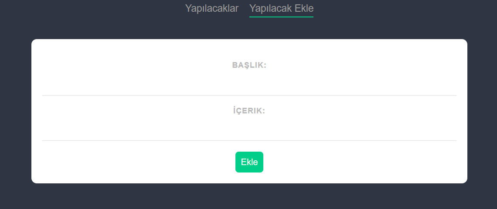
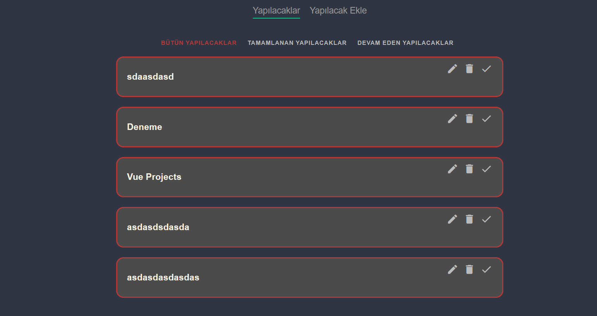

# todo-app

## Project setup

```
npm install
```

### Compiles and hot-reloads for development

```
npm update
npm run serve
json-server --watch ./data/db.json

```### Compiles and minifies for production

```
npm run build
```

### Customize configuration

See [Configuration Reference](https://cli.vuejs.org/config/).


```

### Project Photos

```
```




